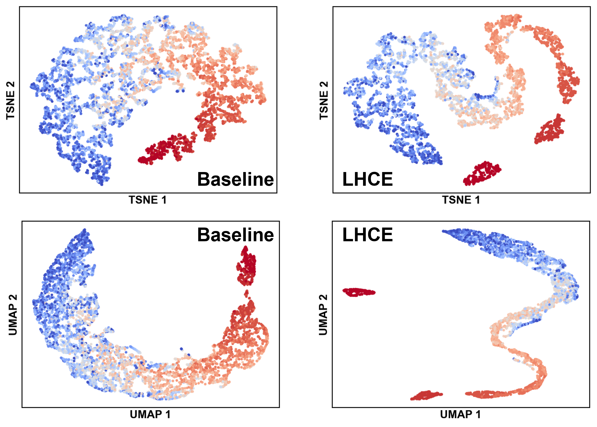
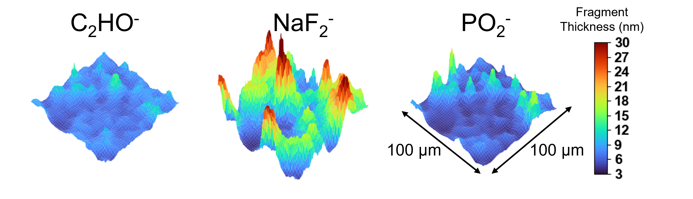

# TOF-SIMS-Data-Analysis

TODO Summary - write a summary of the project 

## Installation instructions
If you are unfamiliar with coding, you may want to start with PyCharm: https://www.jetbrains.com/pycharm/

Below are command line instructions to help get you started. These commands
are designed to work on a Windows machine, the commands may vary slightly on other 
operating systems. 

Chatgpt/other LLMs are your best friend - if you have any issues getting this to work, ask an LLM for help.


1. Install python
2. Download the repo
```commandline
git clone https://github.com/tara-ingebrand/TOF-SIMS-Data-Analysis.git
cd TOF-SIMS-Data-Analysis
```
3. Create a virtual environment to install code in
```commandline
python -m venv venv
```
4. Activate the virtual environment
```commandline
venv\Scripts\Activate.ps1
```
5. Install packages (list ALL packages here)
```commandline
pip install numpy matplotlib scikit-learn umap-learn
```

# Examples 
Say something general about how these are the examples from the paper

-include run instructions for each one 

---

## Joint Principal Component Analysis (PCA)
This script processes 3D TOF-SIMS fragment depth profiles and applies PCA across
multiple samples jointly to identify overarching spatial and chemical patterns
across multiple samples. 
Centroid locations and confidence ellipse geometries provide a summary
of average interphase composition and chemical heterogeneity. 


### Run instructions

```commandline
python .\src\JointPCA.py
```

The script prints the principal component loadings and explained variance 
to the terminal as it runs.

To analyze your own data, modify JointPCA.py.
Set `folder_paths` to the directories containing 
your 3D TOF-SIMS depth profile `.txt` files.  

When preparing input data, ensure that each sample uses the same set of fragments
and that all 3D depth profiles are aligned to the same depth for a fair comparison. 

---
## Individual Principal Component Analysis (PCA)
This script processes 3D TOF-SIMS fragment depth profiles and applies PCA to 
reveal dominant spatial and chemical patterns within an individual dataset.
Individual PCA may be necessary if sample chemistries differ significantly, since 
the relevant fragments may not be the same across samples. 


### Run instructions

```commandline
python .\src\SinglePCA.py
```

The script prints the principal component loadings and explained variance 
to the terminal as it runs.

To analyze your own data, modify SinglePCA.py.
Set `folder_path` to the directory containing 
your 3D TOF-SIMS depth profile `.txt` files.  

When preparing input data, consider the depth range included in the 3D profiles.
When qualitatively comparing multiple samples with separate PCA, ensure that each 
dataset spans an equivalent z-depth to maintain consistency. 

---
## UMAP and t-SNE
This script processes 3D TOF-SIMS fragment depth profiles and applies PCA to 
reveal nonlinear trends such as local clustering and finer chemical heterogeneities.



### Run instructions

```commandline
python .\src\TSNEandUMAP.py
```
Set analysis method (TSNE or UMAP) with `method`

To analyze your own data, modify TSNEandUMAP.py.
Set `folder_path` (line 12) to the directory containing 
your 3D TOF-SIMS depth profile `.txt` files.  

---

## Interphase Thickness PCA
This analysis requires two scripts:
1. FragmentThicknessMaps.py
   1. This script takes the 3D depth profile of a fragment as input and outputs a fragment thickness map
2. FragmentThicknessPCA.py
   1. This script takes fragment thickness maps of several fragments as input and outputs PCA summary


### 1. Fragment Thickness Maps

### Run instructions

```commandline
python .\src\FragmentThicknessMaps.py
```
To analyze your data, set `folder_path` to the directory containing 
your 3D TOF-SIMS depth profile `.txt` files. Update `selected_label` with the 
fragment you would like to analyze. 

---
- Add citation at the end somehow
- maybe also need to cite my own fiures once the paper is published? 